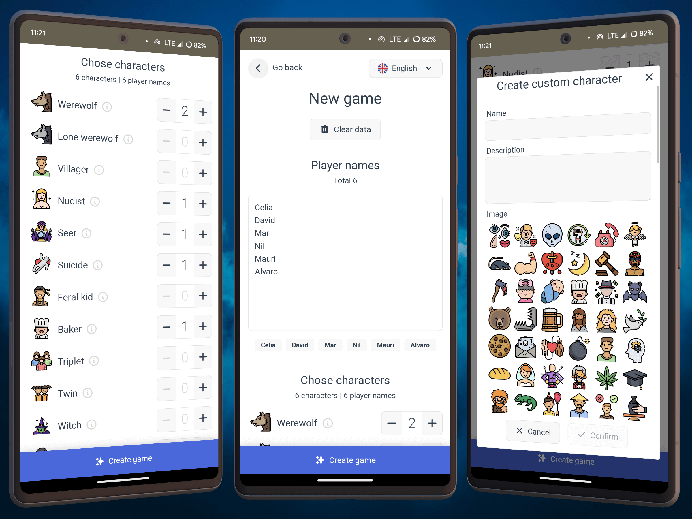
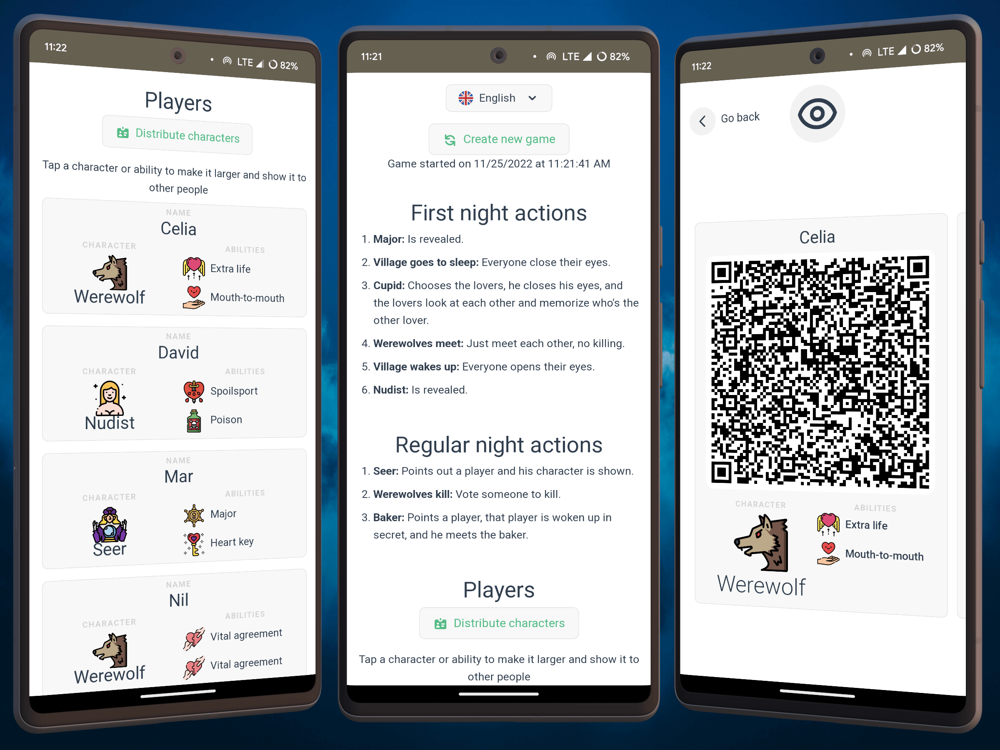
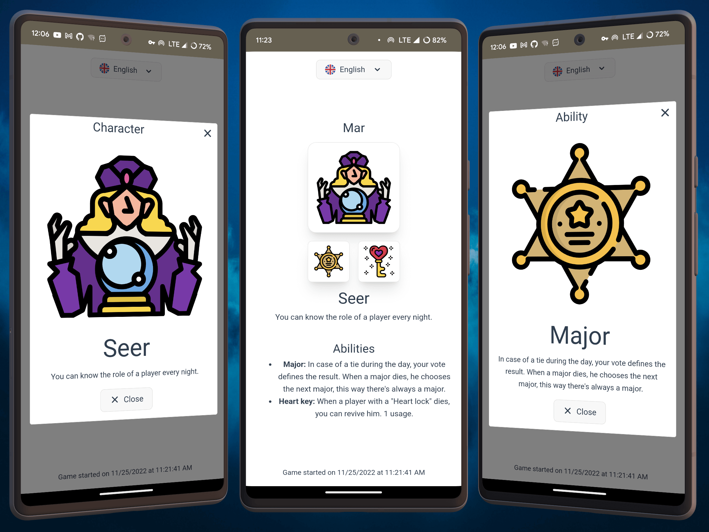
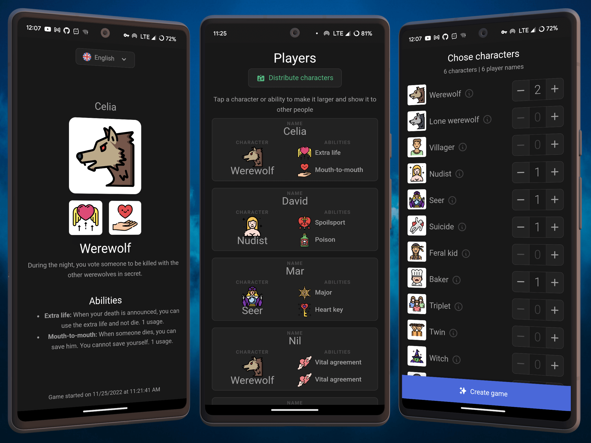

# Werewolf Card Dealer

🃏 PWA to deal werewolf cards

Use it here: <https://wolf.mauri.app/>

This web app lets friends play a custom version of the werewolf game without the need of cards.

Main features:
- Saves progress if closed.
- Responsive design (mobile, tablet and desktop).
- Consistent design.
- Multiple languages.
- Works offline and it's installable.
- Can create custom characters.
- 100% free hosting and DB.
- Easy-to-use and fast.

## Screenshots

